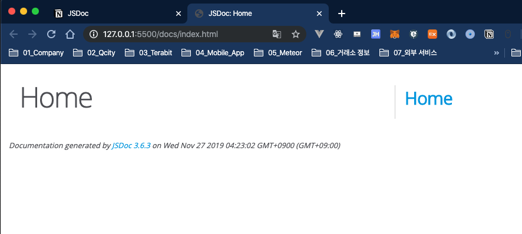

# JSDoc

**참고 Youtuber**
[Documenting Your JavaScript | JSDoc Crash Course](https://youtu.be/YK-GurROGIg)

## jsdoc 설치
```shell
$ npm init -y
$ npm i -D jsdoc
npm notice created a lockfile as package-lock.json. You should commit this file.
+ jsdoc@3.6.3
added 25 packages from 22 contributors and audited 27 packages in 4.438s
found 0 vulnerabilities
```
## jsdoc 설정 파일 생성

`ROOT` 폴더에 `jsdoc.json` 파일을 생성하여 아래와 같이 입력한다.
```json
{
  "source": {
    "include": ["src"],
    "includePattern": ".js$",
    "excludePattern": "(node_modules/|docs)"
  },
  "plugins": ["plugins/markdown"],
  "templates": {
    "cleverLinks": true,
    "monospaceLinks": true
  },
  "opts": {
    "recurse": true,
    "destination": "./docs"
  }
}
```
각 항목에 대한 설명을 알고 싶으면 [[해당 링크]](https://jsdoc.app/about-configuring-jsdoc.html)를 참고하면 된다.

## 빌드 스크립트 추가

`package.json` 파일을 열어 `scripts` 항목에 아래의 내용을 추가한다.
```json
{
  ...
  "scripts": {
    ...
    "doc": "jsdoc -c jsdoc.json"
  }
  ...
}
```
그리고 `src` 폴더를 `ROOT`에 생성하고 그 안에 `index.js`를 생성 후 아래의 명령어를 실행한다.
```shell
$ npm run doc
```
그럼 다음과 같은 폴더 구조로 완성이 될 것이다.

## jsdoc 페이지 생성 확인

`docs` 폴더에 접근하여 안에 있는 `index.html`을 라이브서버로 실행한다. 그럼 아래와 같은 화면이 브라우저 상에서 보여지게 될 것이다.

